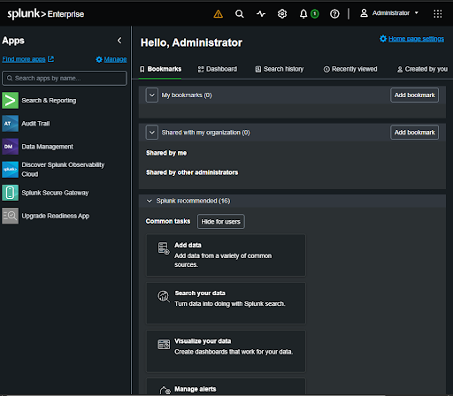
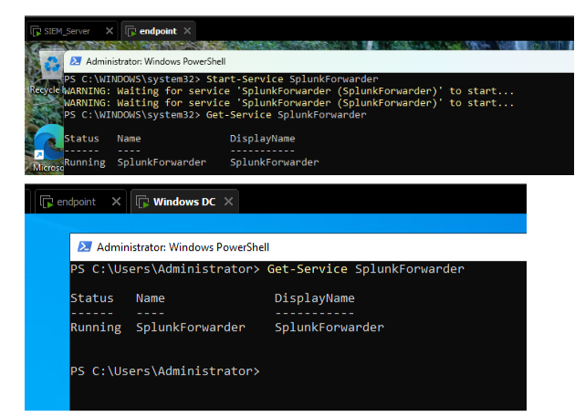
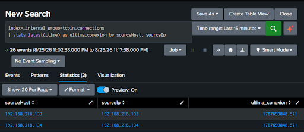
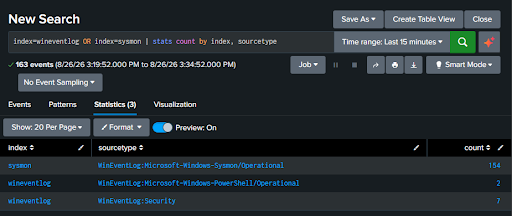
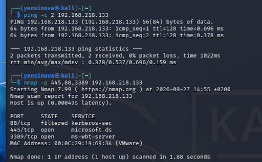
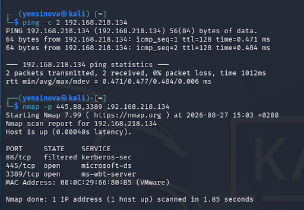
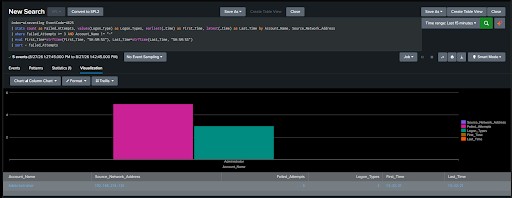
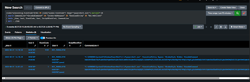

# 🛡️ SOC Home Lab Defensivo — Detección y Respuesta a Amenazas

**Simulación de un entorno corporativo real: Active Directory + SIEM (Splunk 10) + telemetría de endpoint (Sysmon) para detectar ataques mapeados a MITRE ATT&CK, con triaje de incidentes nivel Tier 1.**

> **Autor:** Yensi Jesús González Nova · CompTIA Security+ (SY0-701)
> **Objetivo:** Portafolio profesional para rol de **SOC Analyst Tier 1/2 (Blue Team)**
> **Presupuesto:** 0 € — 100% software gratuito y evaluaciones oficiales
> **Estado:** 🟢 Operativo

---

## 📑 Índice

1. [Resumen Ejecutivo](#-resumen-ejecutivo)
2. [Arquitectura del Laboratorio](#-arquitectura-del-laboratorio)
3. [Ingeniería de Logs](#-ingeniería-de-logs)
4. [Casos de Detección y Triage](#-casos-de-detección-y-triage)
5. [Evidencias](#-evidencias)
6. [Documentación Adicional](#-documentación-adicional)
7. [Roadmap](#-roadmap)
8. [Sobre el Autor](#-sobre-el-autor)

---

## 🎯 Resumen Ejecutivo

Este proyecto replica el ciclo de trabajo real de un SOC: **generación de telemetría → ingesta en el SIEM → detección → triaje → respuesta**. El diseño del laboratorio aprovecha mi experiencia profesional administrando **Active Directory, GPOs y RBAC** y revisando **logs y eventos de seguridad** en entornos corporativos (GXO Logistics), así como mi experiencia en **virtualización con VMware** (proyecto Alstom / Scalian).

**Resultados clave:**
- ✅ Ingesta de **163 eventos** en 15 minutos desde 2 forwarders Windows (Sysmon, Security, PowerShell).
- ✅ Detección de **fuerza bruta** contra el Domain Controller (5 eventos 4625 correlacionados).
- ✅ Detección de **PowerShell ofuscado** estilo fileless (33 eventos 4104 + Sysmon 1).
- ✅ Reconocimiento de red documentado desde Kali Linux (Nmap).

---

## 🏗️ Arquitectura del Laboratorio

| Rol | Sistema Operativo | IP | Función |
|---|---|---|---|
| **Domain Controller** | Windows Server 2022 Eval | `192.168.218.133` | AD DS, DNS, GPOs de auditoría |
| **Endpoint (víctima)** | Windows Enterprise Eval | `192.168.218.134` | Sysmon + PowerShell Logging + UF |
| **SIEM** | Ubuntu Server 22.04 LTS | Red interna | Splunk Free 10.4.1 (puerto 9997) |
| **Atacante** | Kali Linux | Red interna | Nmap, CrackMapExec, Atomic Red Team |

**Hipervisor:** VMware Workstation · **Red:** aislada `192.168.218.0/24` (NAT/Host-Only)

```
[Kali Linux] ──ataques──▶ [DC / Endpoint Windows]
                                  │  (Universal Forwarder)
                                  ▼
                        [Splunk 10.4.1 · Ubuntu]
                                  │  (SPL)
                                  ▼
                        [Analista SOC: detección y triaje]
```

---

## 🔧 Ingeniería de Logs

| Fuente | Event IDs monitorizados | Índice Splunk |
|---|---|---|
| Windows Security | 4624, 4625, 4634, 4720, 4722, 4726, 4732, 4768, 4769, 4771 | `wineventlog` |
| PowerShell (Script Block Logging vía GPO) | 4103, 4104 | `wineventlog` |
| Sysmon (config. SwiftOnSecurity) | 1, 3, 7, 11, 22 | `sysmon` |

---

## 🚨 Casos de Detección y Triage

### UC-01 · Reconocimiento de red (MITRE T1046)
- **Ataque:** `nmap -p 445,88,3389` desde Kali contra DC y Endpoint.
- **Resultado:** puertos 445 (SMB) y 3389 (RDP) expuestos → superficie de ataque confirmada.
- **Lección:** el reconocimiento define el vector; SMB+RDP abiertos anticipan fuerza bruta y movimiento lateral.

### UC-02 · Fuerza bruta contra Active Directory (MITRE T1110)
- **Ataque:** intentos de autenticación SMB fallidos contra `Administrator`.
- **Detección:** agregación de eventos **4625** por cuenta e IP origen (≥3 fallos en 15 min).
- **Resultado real:** 5 eventos 4625 contra `Administrator`.
- **Triage Tier 1:**
  - *Hipótesis:* password spraying/fuerza bruta contra cuenta privilegiada.
  - *Investigación:* revisar IP origen, Logon_Type (3 = red) y buscar 4624 posteriores (compromiso).
  - *Contención:* bloqueo de IP en firewall + deshabilitar cuenta en AD si hay compromiso.
  - *Cierre:* ajustar GPO de Account Lockout y documentar el incidente.

### UC-03 · PowerShell ofuscado / fileless (MITRE T1059.001)
- **Ataque:** `powershell.exe -ExecutionPolicy Bypass -WindowStyle Hidden -EncodedCommand <Base64>`.
- **Detección:** correlación de **4104** (Script Block decodificado) + **Sysmon 1** (línea de comandos completa).
- **Resultado real:** 33 eventos en el host `DESKTOP-043G7GC`.
- **Triage Tier 1:**
  - *Hipótesis:* ejecución de código malicioso en memoria con evasión (Base64).
  - *Investigación:* decodificar ScriptBlockText, extraer hash SHA256 (Sysmon 1) y consultar VirusTotal; revisar conexiones de red (Sysmon 3).
  - *Contención:* aislar el endpoint de la red **sin apagarlo** (preservar RAM para forense).
  - *Cierre:* escalar a IR, aplicar Constrained Language Mode / AppLocker y documentar.

> 📌 Consultas SPL completas en [`docs/reglas_deteccion.spl`](docs/reglas_deteccion.spl)

---

## 📸 Evidencias

### 1. SIEM operativo (Splunk 10.4.1)


### 2. Universal Forwarders activos en DC y Endpoint


### 3. Conexión de forwarders al Indexer (tcpin)


### 4. Ingesta de logs: 154 Sysmon + 7 Security + 2 PowerShell


### 5. Reconocimiento Nmap al Domain Controller


### 6. Reconocimiento Nmap al Endpoint


### 7. Detección de fuerza bruta — 5 eventos 4625 contra Administrator


### 8. Detección de PowerShell ofuscado — 33 eventos (4104 + Sysmon 1)


---

## 📚 Documentación Adicional

- 📑 [Auditoría de Seguridad en Red (PDF original con capturas)](docs/Auditoria_de_Seguridad_en_Red.pdf)
- 📄 [Informe Técnico Completo](docs/Informe_Tecnico.md)
- 🔎 [Reglas de detección SPL](docs/reglas_deteccion.spl)

---

## 🚀 Roadmap

- [ ] Integrar Wazuh como segundo sensor/XDR.
- [ ] Simulaciones automatizadas con Atomic Red Team (Invoke-AtomicRedTeam).
- [ ] Dashboards de métricas MTTD / MTTR en Splunk.
- [ ] Endpoint Linux con `auditd` + `osquery`.
- [ ] Automatización de triaje con Python + Splunk REST API.

---

## 👨‍💻 Sobre el Autor

**Yensi Jesús González Nova** — Analista de Ciberseguridad | Seguridad Defensiva, Hardening y Detección de Amenazas
📍 Guadalajara, España · 📧 yensigonzalesnova55@gmail.com · 🔗 [linkedin.com/in/yensinova](https://linkedin.com/in/yensinova/)

CompTIA Security+ (SY0-701). Experiencia en revisión de logs, Active Directory (IAM, GPO, RBAC, mínimo privilegio), virtualización VMware, análisis de red con Wireshark y scripting en Python.